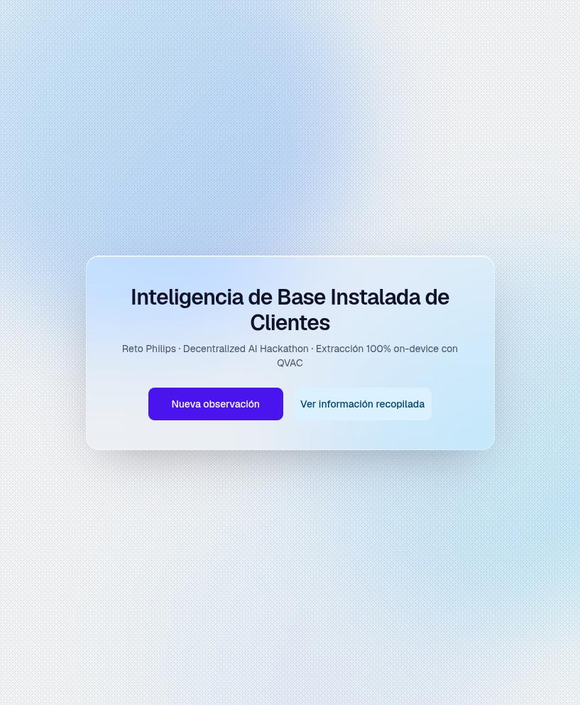
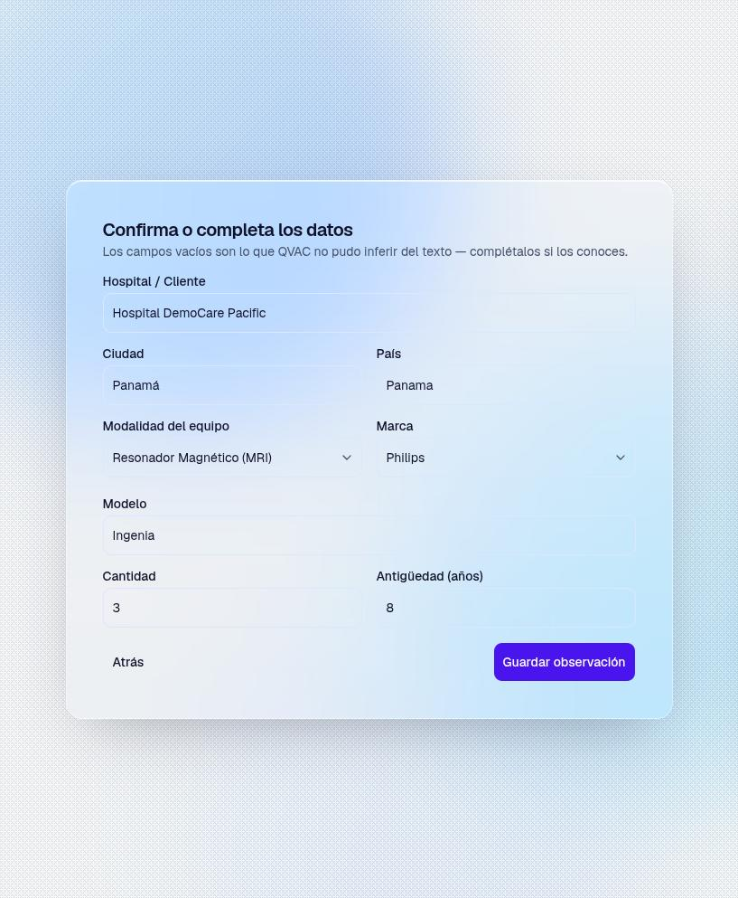
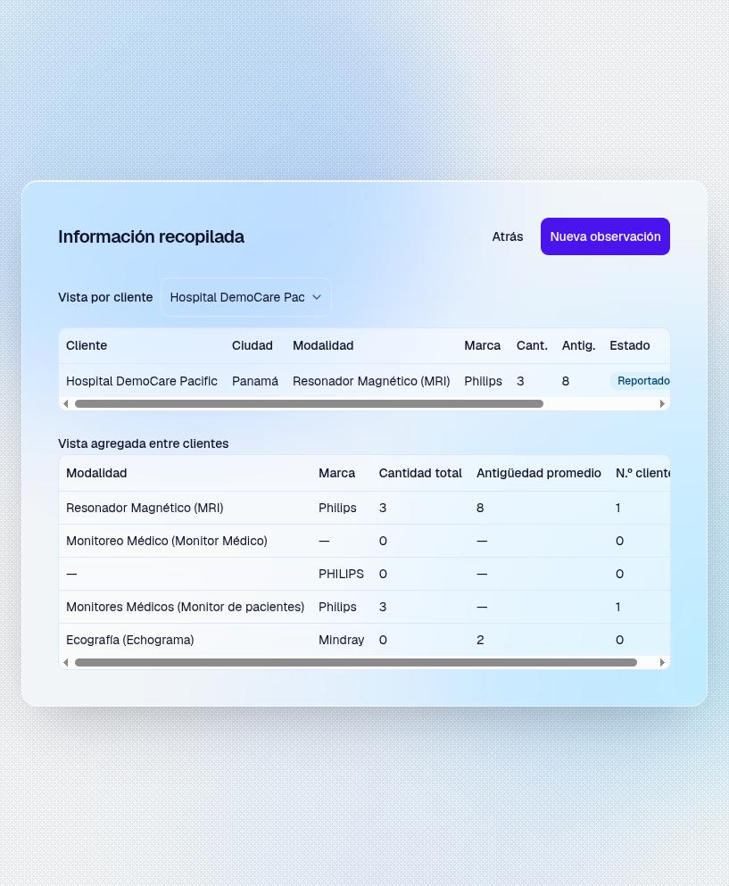
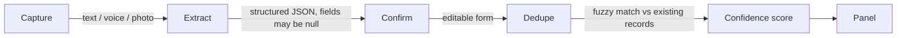
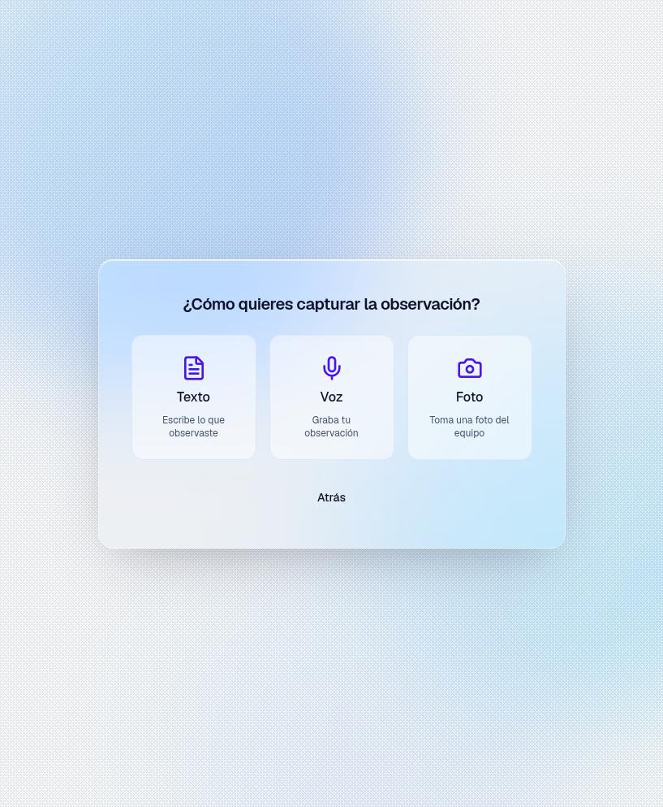
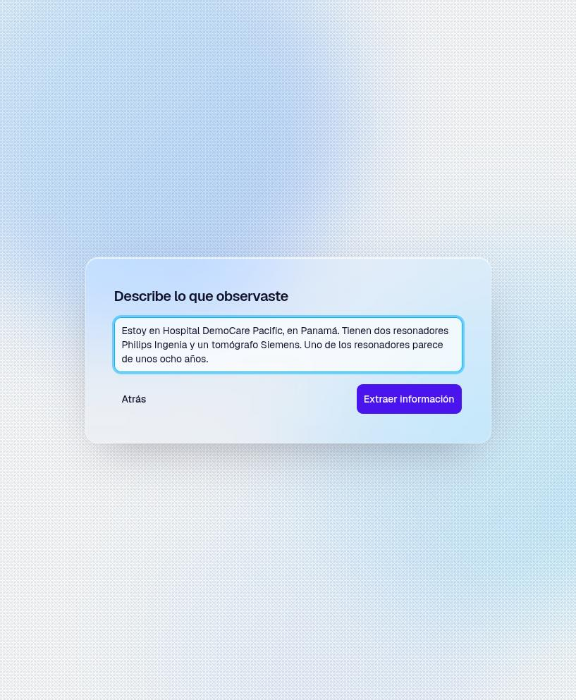

# Customer Installed Base Intelligence

**Philips challenge submission for the Decentralized AI Hackathon, ISD Summit Panama (Sept 2026)**


[](LICENSE)

A field rep visits a hospital, talks about the equipment they see, and this app
turns that into structured installed-base data (customer, city, modality,
brand, model, quantity, age) without typing a form. Every inference step runs
locally through the [QVAC SDK](https://qvac.tether.io) on the same machine
running the app. No request ever reaches a cloud LLM.

📹 **Demo video:** _add the link here before submitting_

<p align="center">
  
  
  
</p>

## The problem

Field reps who audit hospital equipment fleets fill out this data by hand,
after the visit, from memory or notes. Hospitals are exactly the kind of
place QVAC's on-device model is built for: intermittent Wi-Fi, no clearance
to install unapproved software that phones home, and a rep with a phone in
their pocket, not a laptop. A cloud API call is a bad fit here even before
counting the hackathon rule against it.

## The hard requirement, addressed directly

> Inference must run on-device or peer-to-peer via QVAC. Routing inference to
> a cloud API disqualifies the submission regardless of quality.

This app never calls a cloud LLM. `qvac_client.py` is the single place that
talks to QVAC, connecting once per process and loading models lazily on
first use. Every model listed below runs through that one path. The FastAPI
backend hosting the UI is the only network-facing part of the stack, and it
serves static assets and local API calls, nothing else.

We went further than a desktop demo: [`context/termux-android-demo.md`](context/termux-android-demo.md)
documents running this exact, unmodified stack inside Termux on an Android
phone, so the model genuinely executes on a phone's own ARM CPU rather than
staying a theoretical claim. `install.sh` sets both paths up from one command
(see [Run it](#run-it) below).

No preexisting boilerplate, starter kit, or prior codebase was used as a
base for this submission. Everything in this repo was written during the
hackathon window.

## How it works



1. **Capture.** Text, voice, or a photo of an equipment nameplate.
2. **Extract.** A small model reads the text (or the photo's description)
   and returns structured fields as grammar-constrained JSON, so the output
   is always valid against the schema, never free text to parse.
3. **Confirm.** Whatever the model could not infer comes back `null` and
   lands as an empty field in an editable form. This is deliberate: a
   multi-turn dialogue manager to ask follow-up questions would add real
   complexity for something an editable form already solves.
4. **Dedupe.** `rapidfuzz` compares the new observation against existing
   records (customer + city + modality + brand) and merges a strong match
   as corroboration instead of creating a duplicate row.
5. **Confidence.** `0.7 × completeness + 0.3 × corroboration`, mapped to
   Confirmed / Reported / Estimated / Unknown.
6. **Panel.** Per-customer view and an aggregated view (modality × brand)
   across every customer in the database.

<p align="center">
  
  
  
  
  
</p>

<sub>Real output from a live run: an actual QVAC extraction against the
observation typed into the capture screenshot above.</sub>

## Models

Named and quantized honestly, as loaded by `qvac_client.py`:

| Step | Model | Quantization | Params | Fallback |
|---|---|---|---|---|
| Extraction | Qwen3-1.7B-Instruct | Q4 | 1.7B | Llama-3.2-1B-Instruct (Q4_0) if the primary fails to load |
| Transcription | Whisper small | Q8_0 | ~240M | n/a |
| Photo to text | VisionPsy-Nano-460M (multimodal) | Q4_K_M, mmproj Q8_0 | 460M | n/a |

VisionPsy is one of QVAC's dedicated small "Psy" models, built for exactly
this kind of edge deployment. It is genuinely inconsistent at reading small
printed text on equipment labels: sometimes it confirms its own reading and
contradicts itself in the same response. We chose not to add confidence
heuristics on top of a 460M-parameter model's guesses. When it fails, the
review form comes back empty, same as it would for unclear voice input, and
the rep fills it in by hand. Papering over that with false confidence would
be worse than an honest empty field, especially for a submission this
project is not formally entering but clearly demonstrates the spirit of:
useful domain intelligence from very small models on modest hardware, the
same premise behind the hackathon's dedicated QVAC Psy track.

## Engineering notes worth a closer look

- **Grammar-constrained extraction.** The JSON Schema for the extraction
  fields is enforced at the decoding level (`extract.py`), not validated
  after the fact. The model cannot produce invalid JSON.
- **One asyncio loop for the process lifetime.** QVAC's RPC transport binds
  to the event loop that created it. `qvac_client.py` keeps one loop alive
  for the whole process and serializes calls through a lock, so two
  overlapping requests never fight over it. Documented in
  [`context/qvac-integration-notes.md`](context/qvac-integration-notes.md)
  alongside the other integration bugs we hit and fixed, not guessed at.
- **Built for phone screens from the start.** Every step wrapper uses `dvh`
  instead of `vh`, since a mobile browser's address bar and the on-screen
  keyboard both break naive `100vh`. Touch targets sit at the ~44px minimum,
  and safe-area insets keep content clear of notches and gesture bars.
- **A dithered background and a translucent glass panel.** The background
  is an ordered (Bayer) dither rendered as an 8×8 SVG tile, a nod to the
  halftone scan pattern on Philips diagnostic-monitor displays. It pans in
  sync with each step transition, while the working panel above it uses a
  real `backdrop-blur-2xl` so the material reads as glass.
- **A one-line installer for both targets.** `install.sh` auto-detects
  Termux and installs the right dependency set for either a normal desktop
  or a phone, including the two Termux-specific fixes we hit on a real
  device (no writable `/tmp` at the standard path, `pydantic-core` needing
  Termux's own Rust toolchain since it has no prebuilt wheel for
  `aarch64-linux-android`).

## Run it

**One command, either target** (auto-detects Termux vs. desktop):

```bash
curl -fsSL https://raw.githubusercontent.com/alioth-stat/phillips-installed-base-intelligence/master/install.sh | bash
```

On a desktop this clones the repo and launches both servers. Pasted into
Termux on an Android phone, it installs the on-device path instead, see
[`context/termux-android-demo.md`](context/termux-android-demo.md) for what
that proves and why a wrapped web app would not prove the same thing.

**Manual setup:**

```bash
python3 -m venv .venv
.venv/bin/pip install -r requirements.txt
cd frontend && npm install
```

`ffmpeg` must be installed on the system (used to transcode browser
`MediaRecorder` audio to WAV before handing it to QVAC). The first QVAC call
downloads the worker and model weights once. If it is not found
automatically:

```bash
.venv/bin/python -m tetherto.qvac_sdk install-worker
```

**Then, one command for both servers** (Ctrl+C stops both):

```bash
./run.sh
```

Open `http://localhost:5173`. The Vite dev server proxies `/api/*` to the
FastAPI backend on port 8000.

A Streamlit fallback UI exists at `app.py` (`.venv/bin/streamlit run app.py`),
kept working but not where new frontend work goes.

## Tests

```bash
.venv/bin/python -m pytest -q
```

16 tests, pure logic (schema normalization, dedup matching, confidence
scoring, DB round-trips), no model loading, offline and fast.

## Project structure

| Path | Responsibility |
|---|---|
| `api.py` | FastAPI backend, wraps the modules below, no business logic of its own |
| `qvac_client.py` | The one place that talks to the QVAC SDK |
| `extract.py` | JSON Schema, extraction prompt, output normalization |
| `dedupe.py` | Fuzzy duplicate detection (`rapidfuzz`) |
| `confidence.py` | Confidence score and status |
| `db.py` | SQLite storage (observations + taxonomy), no ORM |
| `taxonomy.csv` | 20 equipment modalities, 20 manufacturer brands |
| `frontend/` | React 19 + Vite + TypeScript + Tailwind v4 + shadcn/ui |
| `app.py` | Streamlit fallback UI, kept working, not actively developed |
| `install.sh` | One-line installer, desktop and Termux/Android |
| `context/` | Hackathon rules, QVAC research, and integration notes verified against real runs, see [`context/README.md`](context/README.md) |

## Deliberately out of scope

- **Multi-turn dialogue for follow-up questions.** An editable form with the
  fields the model could not infer solves the same problem without a
  conversation manager.
- **Confidence heuristics for VisionPsy's photo readings.** Covered above,
  under Models.

## Language note

The product UI and the extraction prompts are in Spanish. That is
deliberate: the field reps this app is built for work in Panama and speak
Spanish, and the example in the challenge brief itself is written in
Spanish. This README is in English for the judges. The original Spanish
README is kept at [`README.es.md`](README.es.md).

## License

[Apache License 2.0](LICENSE). Chosen over MIT for the explicit patent
grant: it protects both this project and anyone building on it, which
matters more for AI-model-adjacent code than a typical web app. The general
track does not require an open license; the QVAC Psy track does, and this
satisfies it.
